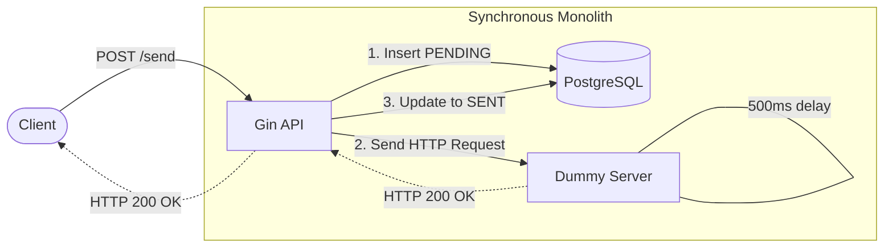
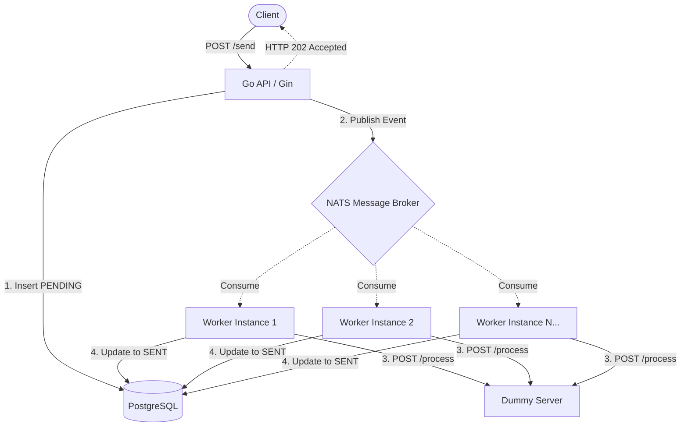
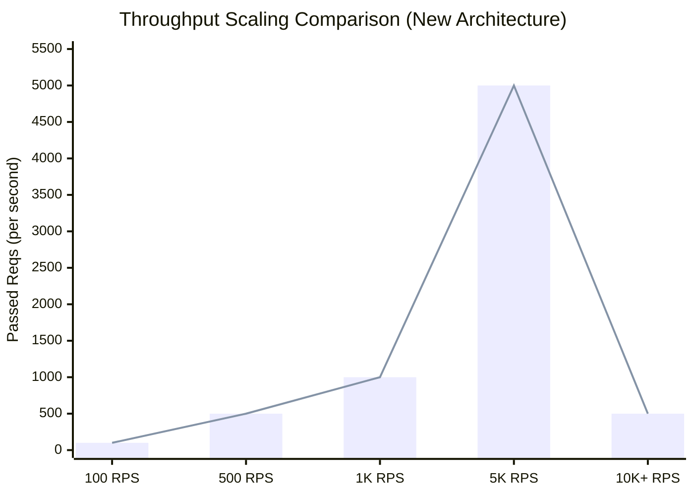

# Gotification - Distributed Notification System 🚀

This is an experimental Distributed Notification System created to demonstrate a notification system architecture that scales from a simple monolith into a fully asynchronous distributed setup using Go, PostgreSQL, NATS, and worker nodes.

The primary goal of this branch is to explore system separation, implement asynchronous message queues, and dramatically improve the maximum throughput and scalability of the API.

## 🏃 How to Run

You can spin up the entire system—including PostgreSQL, NATS, and all microservices—using Docker Compose.

To start the system with a specific number of background workers for consumption, use the `--scale` flag (for example, to set up 5 workers):

```bash
docker compose up --build --scale worker=5 -d
```

This will automatically create the necessary containers: the backend API (`api`), the dummy processing server (`dummy`), the message broker (`nats`), the database (`db`), and 5 instances of the `worker`.

## 🏗 System Architecture Evolution

### Phase 1: The "Happy Path" (Monolith-ish)

Before distributing everything, you need the core logic to work. In this phase, we built the API and the Dummy Server as two separate processes.

*   **The API:** Create a Gin endpoint `/send` that accepts a JSON payload (`UserId`, `Message`, `Title`).
*   **The DB:** Set up PostgreSQL. Create a `notifications` table to log every request with a status of `PENDING` or `SENT`.
*   **The Dummy Server:** A separate Go app that listens on a different port, waits 500ms, and returns a `200 OK`.
*   **Goal:** The API receives a request, writes to Postgres, calls the Dummy Server via HTTP, updates Postgres to `SENT`, and returns a response to the user.



### Phase 2: The Final Distributed Architecture

To overcome the immense synchronous bottlenecks that heavily limit API performance, the processing logic was decoupled, leveraging an asynchronous event-driven layout using **NATS** and isolated background **Workers**.

*   The API simply accepts requests, saves as `PENDING` in the database, pushes an event to NATS, and immediately responds with a `202 Accepted`.
*   NATS automatically spreads the load across worker instances.
*   Workers listen to NATS, execute the HTTP call to the Dummy Server to process notifications, and ultimately update the DB record to `SENT`.



## 📊 Performance Testing (Vegeta)

To validate the benefits of microservices processing, we extensively load-tested both architectures using the [Vegeta](https://github.com/tsenart/vegeta) load testing tool.

### Initial Architecture (Synchronous)

The API was extremely bottlenecked by the artificial 500ms processing delay inside the single execution flow.

| Target RPS | Actual Throughput | Success Rate | P99 Latency | Max Latency | Errors Encountered |
|------------|-------------------|--------------|-------------|-------------|----------------|
| 10 | 9.86 | 100.00% | 1.59s | 1.64s | - |
| 50 | 48.44 | 100.00% | 1.40s | 1.46s | - |
| 100 | 95.27 | 97.10% | 1.40s | 1.49s | 500 Internal Server |
| 250 | 190.15 | 79.84% | 1.57s | 1.99s | 500 Internal Server |
| **500** | **204.93** | **66.37%** | **30.00s** | **30.00s** | 500 Errors, Deadline Exceeded |

At just 500 RPS, the server began drastically failing due to blocked DB and API connections. Latencies completely skyrocketed.

---

### New Architecture (Distributed & Asynchronous)

With the asynchronous format properly shifting workload onto background threads, API throughput dramatically skyrocketed as the application ceased stalling while waiting on processing limits.

| Target RPS | Actual Throughput | Success Rate | P99 Latency | Max Latency | Errors Encountered |
|------------|-------------------|--------------|-------------|-------------|----------------|
| 10 | 10.03 | 100.00% | 1.67s | 1.92s | - |
| 50 | 50.03 | 100.00% | 3.31ms | 4.36ms | - |
| 100 | 100.03 | 100.00% | 2.74ms | 19.66ms | - |
| 250 | 250.02 | 100.00% | 2.50ms | 25.81ms | - |
| 500 | 500.01 | 100.00% | 147.19ms | 199.87ms | - |
| 1000 | 999.96 | 100.00% | 148.20ms | 720.03ms | - |
| **5000** | **4999.91** | **100.00%** | **4.49ms** | **213.36ms** | - |
| **10000** | **8251.18** | **90.98%** | **12.43s** | **27.69s** | *bind: address already in use* |
| **15000** | **535.62** | **7.63%** | **2.47s** | **7.05s** | *bind: address already in use* |

*(Note: At 15,000 RPS, our testing hardware PC was fundamentally overwhelmed. TCP ephemeral ports were exhausted faster than the system could reclaim them, leading to `bind: address already in use` local dial errors. The API could likely scale further on distributed test runners).*

### Visual Analysis

To better represent the paradigm shift, observe the comparison of successfully processed throughput mapping onto the client's request attempts:


